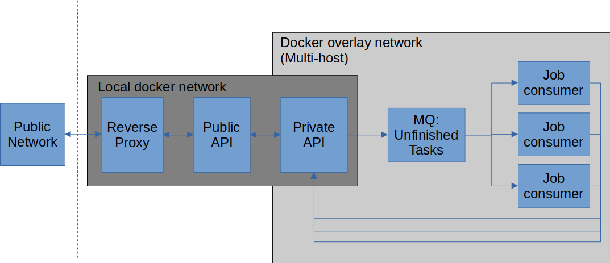

# InferenceServer
## Purpose
InferenceServer provides an HTTP API for running computational tasks on a GPU-accelerated multi-node cluster.

## Definitions
### Model
A model is essentially a docker container, in which a given computational workflow is wrapped. It is associated with 
a `container_tag`, which is the actual tag of the docker image to run, and a `human_readable_id`, which is a static id
used to consistently direct tasks to the model.  
A model receives data of a `Task` in `/input` and should write all outputs to `/output` in the docker container pointed at
by the `human_readable_id`. Optionally, one can provide static content in `/model`, like model files, which are
unsuited for being put publicly on docker hub.

### Task
A `Task` is essentially a zip-file containing the input for a model. It is sent to InferenceServer with the parameter 
`model_human_readable_id`, which directs the input data to the correct model.

## Overview of InferenceServer services
InferenceServer consists of five distinct services, namely:
### Reverse proxy
  - Takes care of TLS encryption of data in transit (HTTPS)
  - Relays decrypted traffic to the public API
### Public api
- A relay to the private API of only the HTTP endpoints which can be publicly available
### Private api
- Serves as the database of everything.
- Knows which models that can be executed
- Receives new tasks and publish their ID in a message queue for unfinished tasks (see below)
- Serves task outputs back to the public api, when requested.
### Message queue handler (RabbitMQ)
- A message broker, which serves a message queue for unfinished tasks
- Job consumers listen to the message queue for unfinished tasks
### Job consumers
- Should be spawned one per GPU.
- Can be spawned on other hosts, and join the network with docker swarm and overlay networks.
- Listens to the message queue of unfinished tasks.
- When a new task ID is allocated to the job consumer, it requests all relevant data from the private api:
  - Input of the `Task`
  - `Model` (see definition above)
- Spawns the `Model`-docker container as a "sibling"-container.
  - Creates docker volumes with task input, output and static model data
  - Mounts docker volumes on `/input`, `/output` and `/model` to the model
  - Executes the model's workflow
  - Sends back a zip-file of `/output` to the private api 
  - Deletes all input and output volumes, but keeps the model for future tasks.  

## Schematic overview


# Usage
## Installation
InferenceServer depends on:
- All servces: docker, docker-compose
- Job-consumer: A GPU, nvidia-docker2, nvidia and CUDA drivers

### How to host
- Download the `docker-compose.yaml` and adjust to your local setting
- Make sure you have a vaild domain
- Add certificates in traefik/certs and make sure the naming matches traefik/configuration/config.toml.
There is a script to generate certs in traefik/certs/generate_self_signed_certs. Make sure the domain you host on is equal to the certificate.
- Consider to set up a docker swarm for multi host docker overlay network (See official docker documentaiton for this)
- Run `docker-compose up -d`

### How to use
The public api can be inspected and tested at `https://domain.org/docs`
Generally the following two methods are useful:

#### Post model
Use OpenAPI interface on `https://domain.org/docs` (can be done on either the public or the private API as well)

or  

HTTP POST on `https://domain.org/api/tasks/`
With python requests it can be reached like:
```
with open("path/to/model.zip", "br") as r:
    res = requests.post(url=https://domain.org/api/tasks/,  
                        params = {  
                            "container_tag": mathiser/inference_server_models:some_inference_stuff,  
                            "human_readable_id": "easy_to_write_must_be_unique", 
                            "description": "This model is a test inference model",  
                            "model_available": True,  
                            "use_gpu": True  
                        },  
                        files = {"zip_file": r})  
```
Note, that sending a `model.zip` is optional. If not send, you should set `model_available: False`.
Then you probably want to submit a job. This can be done like:
```
with open("input.zip", "br") as r:
    res = requests.post(url=https://<domain>/api/tasks/,
                        params={"model_human_readable_id": "easy_to_write_must_be_unique"})
    if res.ok:
        task_uid = json.loads(res.content)
```

When a task is submitted, and you have successfully received the task_uid, you poll the server to check if the job is done.
```
res = requests.get(url=https://domain.org/api/tasks/{uid})
if res.ok:
  with open("output.zip", "bw") as f:
    f.write(res.content)
else:
  <check the status codes below>
```

Status codes on task polling:
- 500: Internal server error
- 551: Task pending
- 552: Task failed
- 553: Task finished, but output zip not found.
- 554: Not found


It completely normal to receive 554 immediatly after a task is posted, but you should receive 551 soon after.

### How to reset
- Doing a soft reset keeping all data intact:  
`docker-compose down && docker-compose up -d`

- Doing a slightly harder reset pruning volumes that might have caused a failure:  
```
docker-compose down
docker volume prune  # Watchout if you have not binded the datadir to persistent storage!
docker-compose up -d
```

- Full take down of the entire server and start anew:  
```
docker-compose down
docker volume prune
rm mount  # or where the persistent data store is located
docker-compose up -d
```
Repost your models to the server with your own script or go to `https://inferenece_server.domain.com/docs` and add them manually (remember to set `ALLOW_PUBLIC_POST_MODEL` to something/anything in your `.env` (e.g. `ALLOW_PUBLIC_POST_MODEL=1`) to post models.)  

A commandline client is under development [here](https://github.com/mathiser/inference_server_client)
## Model creation
See this [repo](https://github.com/mathiser/inference_server_models) for examples and documentation


