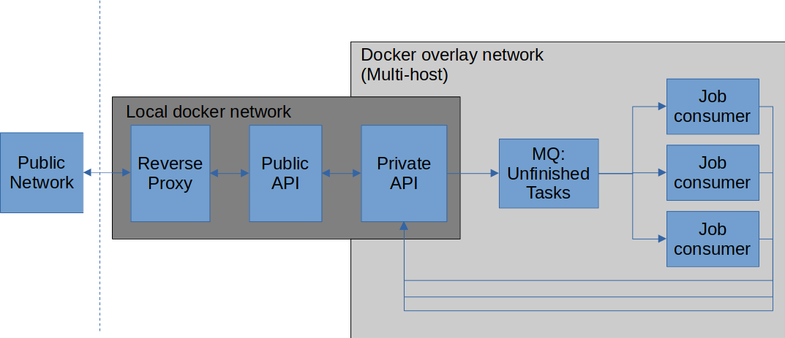

# Documentation of InferenceServer
## Purpose
InferenceServer provides an HTTP API for running computational tasks on a GPU-accelerated multi-node cluster.

## Definitions
### Model
A model is essentially a docker container, in which a given computational workflow is wrapped. It is associated with 
a `container_tag`, which is the actual tag of the docker image to run, and a `human_readable_id`, which is a static id
used to consistently direct tasks to the model.  
A model receives data of a `Task` in `/input` and should write all outputs to `/output` in the docker container pointed at
by the `human_readable_id`. Optionally, one can provide static content in `/model`, like model files, which are
unsuited for being put publicly on docker hub.

### Task
A `Task` is essentially a zip-file containing the input for a model. It is sent to InferenceServer with the parameter 
`model_human_readable_id`, which directs the input data to the correct model.

## Overview of InferenceServer services
InferenceServer consists of five distinct services, namely:
### Reverse proxy
  - Takes care of TLS encryption of data in transit (HTTPS)
  - Relays decrypted traffic to the public API 

### Public api
- A relay to the private API of only the HTTP endpoints which can be publicly available
### Private api
- Serves as the database of everything.
- Knows which models that can be executed
- Receives new tasks and publish their ID in a message queue for unfinished tasks (see below)
- Serves task outputs back to the public api, when requested.
### Message queue handler (RabbitMQ)
- A message broker, which serves a message queue for unfinished tasks
- Job consumers listen to the message queue for unfinished tasks
### Job consumers
- Should be spawned one per GPU.
- Can be spawned on other hosts, and join the network with docker swarm and overlay networks.
- Listens to the message queue of unfinished tasks.
- When a new task ID is allocated to the job consumer, it requests all relevant data from the private api:
  - Input of the `Task`
  - `Model` (see definition above)
- Spawns the `Model`-docker container as a "sibling"-container.
  - Creates docker volumes with task input, output and static model data
  - Mounts docker volumes on `/input`, `/output` and `/model` to the model
  - Executes the model's workflow
  - Sends back a zip-file of `/output` to the private api 
  - Deletes all input and output volumes, but keeps the model for future tasks.  

## Schematic overview
